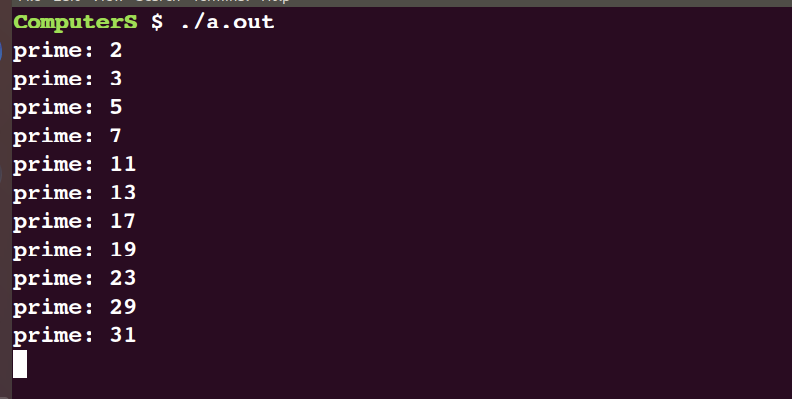

# lab1

## 0.实验环境配置
配置xv6的实验环境网上教程较多，此处就不再进行过多的细节讲述，请读者自行查看知乎或其他博客。


## 1.sleep(easy)
要求在`user`文件夹中实现`sleep.c`，使得用户可以在命令行中输入:
```bash
sleep <number>
```
来调用`sleep`程序，代码比较简单，实现如下:

```c
#include "kernel/types.h"
#include "kernel/stat.h"
#include "user/user.h"

int
main(int argc, char *argv[])
{

	if(argc != 2){
		printf("Usage: sleep <number>\n");
		exit(1);
	}
	
	int stime = atoi(argv[1]);
	sleep(stime);

	exit(0);
}
```

## 2.pingpong(easy)
这个练习也比较简单，主要是要熟悉`Unix`中的几个系统函数和管道工具:
```c
pipe / fork / read / write / getpid
```
代码实现如下:
```c
#include "kernel/types.h"
#include "kernel/stat.h"
#include "user/user.h"

int
main(int argc, char *argv[])
{
	int pid;
	int pipefd[2];

	// 创建管道, pipefd[0]为读取端, pipefd[1]为写入端
	if(pipe(pipefd) == -1){
		printf("Create pipe failed.\n");
		exit(1);
	}

	// 创建子进程
	pid = fork();

	if(pid == 0){
		char buf[2];
		if(read(pipefd[0], buf, 1) < 0){
			printf("read from parent failed.\n");
			exit(1);
		}
		close(pipefd[0]);
		printf("%d: received ping\n", pid);
		
		if(write(pipefd[1], buf, 1) < 0){
			printf("write to parent failed.\n");
			exit(1);
		}
		close(pipefd[1]);
		exit(0);
	}
	else{
		char message[2] = "a";
		char buf[2];
		if(write(pipefd[1], message, 1) < 0){
			printf("write in child failed.\n");
			exit(1);
		}
		close(pipefd[1]);
		wait(0);
		if(read(pipefd[0], buf, 1) < 0){
			printf("read from child failed.\n");
			exit(1);
		}
		printf("%d: received pong\n", pid);
		close(pipefd[0]);
		exit(0);	
	}
}
```


## 3.primes(moderate/hard)

```c
#include <stdio.h>
#include <sys/wait.h>
#include <stdlib.h>
#include <unistd.h>

void primes(int pipefd[]) {
    int Prime, n;
    if (read(pipefd[0], &Prime, sizeof Prime) != 4) {
        printf("Read number failed!\n");
        exit(1);
    }
    printf("prime: %d\n", Prime);
    
    int next_p[2];
    pipe(next_p);
    int pid = fork();
    if (pid == -1) {
        printf("Fork failed!\n");
        exit(1);
    }
    else if (pid == 0) {
        primes(next_p);   
        exit(0);          
    }
    else {
        close(next_p[0]); 
        while (read(pipefd[0], &n, sizeof n) > 0) {
            if (n % Prime != 0) write(next_p[1], &n, sizeof n);
        }
        close(pipefd[0]); 
        close(next_p[1]); 
        wait(NULL);       
    }
    exit(0);
}

int main() {
    int pipefd[2];
    pipe(pipefd);

    int pid = fork();
    if (pid == -1) {
        printf("Fork failed!\n");
        exit(1);
    }
    else if (pid == 0) {
        primes(pipefd);   // Call primes function
        exit(0);          
    }
    else {
        close(pipefd[0]); 
        for (int i = 2; i <= 35; i++) {
            if (write(pipefd[1], &i, sizeof i) != sizeof i) {
                printf("Write numbers in pipe failed!\n");
                exit(1);
            }
        }
        close(pipefd[1]); 
        wait(NULL);       
    }
    exit(0);
}

```

按照要求容易写出以上代码，但是当运行时出现bug，即程序最终不会自动结束，而是会进入死循环:



然后就是快(痛)乐(苦)的debug时间了:

首先分析，程序没有终止，说明存在进程没有运行到`exit()`语句，经过简单思考后，可以知道一定是存在子进程没有正确终止。因为如果子进程都正常结束，那么父进程在`wait(0)`后一定会进入`exit(0)`，从而完成整个程序的退出。所以，重点就是对于`primes`函数的分析。

期间尝试了各种办法，最后查明了程序异常的原因:
对于第一次从`main`创建子进程，调用`primes`进入的时候，对于子进程来说，只从管道中读取，而不向管道中写入。但是可以看到，在进入`primes`时，并没有将传入参数`pipefd[1]`，也就是管道的写端关闭。

对于管道来说，如果存在某个写端没有关闭，那么这个程序在对管道进行读取的时候，当管道为空时，就会阻塞等待，直到有数据输入。只有当写端被关闭时，读取空管道才会失败并直接返回，不进入阻塞状态。最终的修改代码如下:

```c
#include "kernel/types.h"
#include "kernel/stat.h"
#include "user/user.h"

void primes(int pipefd[]) {
    int Prime, n;
	close(pipefd[1]);
    if (read(pipefd[0], &Prime, sizeof Prime) != 4) {
        printf("Read number failed!\n");
        exit(1);
    }
    printf("prime %d\n", Prime);
   
	int flag = read(pipefd[0], &n, sizeof 4);
	if(flag){
		int next_p[2];
		pipe(next_p);
		int pid = fork();
		if (pid == -1) {
			printf("Fork failed!\n");
			exit(1);
		}
		else if (pid == 0) {
			primes(next_p);   // Recursively call primes with the new pipe
			exit(0);          // Exit child process after recursive call
		}
		else {
			close(next_p[0]); // Close read end of the new pipe
			if (n % Prime != 0) write(next_p[1], &n, sizeof n);
			while (read(pipefd[0], &n, sizeof n) > 0) {
				if (n % Prime != 0) write(next_p[1], &n, sizeof n);
			}
			close(pipefd[0]); // Close read end of the current pipe in parent process
			close(next_p[1]); // Close write end of the new pipe
			wait(0);       // Wait for child process to terminate
		}
	}
    exit(0);
}

int main() {
    int pipefd[2];
    pipe(pipefd);

    int pid = fork();
    if (pid == -1) {
        printf("Fork failed!\n");
        exit(1);
    }
    else if (pid == 0) {
        primes(pipefd);   // Call primes function
        exit(0);          // Exit child process after primes function
    }
    else {
        close(pipefd[0]); // Close read end of the pipe in parent process
        for (int i = 2; i <= 35; i++) {
            if (write(pipefd[1], &i, sizeof i) != sizeof i) {
                printf("Write numbers in pipe failed!\n");
                exit(1);
            }
        }
        close(pipefd[1]); // Close write end of the pipe in parent process
        wait(0);       // Wait for child process to terminate
    }
    exit(0);
}
```

## 4.find(moderate)
要求实现一个简化版的`find`程序，能够递归地去查找子目录，但不包括`.`和`..`两级目录。

实现代码如下:
```c
#include "kernel/types.h"
#include "kernel/stat.h"
#include "user/user.h"
#include "kernel/fs.h"

#define MAX_PATH_LEN 512

void ffind(char *dir, char *ffile){
    char buf[MAX_PATH_LEN];
    char *p;
    int fd;
    struct dirent de;
    struct stat st;

    if((fd = open(dir, 0)) < 0){
        fprintf(2, "find: cannot open %s\n", dir);
		close(fd);
        return;
    }
    if(fstat(fd, &st) < 0){
        fprintf(2, "find: cannot stat %s\n", dir);
        close(fd);
        return;
    }

    switch(st.type){
        case T_FILE:
            fprintf(2, "find: %s is not a directory\n", dir);
            close(fd);
            return;
        case T_DIR:
            if(strlen(dir) + 1 + DIRSIZ + 1 > MAX_PATH_LEN){
                fprintf(2, "find: path too long\n");
                close(fd);
                return;
            }
            strcpy(buf, dir);
            p = buf + strlen(buf);
            *p++ = '/';

            while(read(fd, &de, sizeof de) == sizeof de){
                if(de.inum == 0 || strcmp(de.name, ".") == 0 || strcmp(de.name, "..") == 0)
                    continue;
                if(strlen(p) + strlen(de.name) + 1 > MAX_PATH_LEN){
                    fprintf(2, "find: path too long\n");
                    continue;
                }
                strcpy(p, de.name);
                if(stat(buf, &st) < 0){
                    fprintf(2, "find: cannot stat %s\n", buf);
                    continue;
                }
                if(st.type == T_DIR)
                    ffind(buf, ffile);
                else if(st.type == T_FILE && strcmp(de.name, ffile) == 0)
                    printf("%s\n", buf);
            }
            break;
    }
    close(fd);
    return;
}

int main(int argc, char *argv[]){
    if(argc != 3){
        fprintf(2, "Usage: find <directory> <file>\n");
        exit(1);
    }
    ffind(argv[1], argv[2]);
    exit(0);
}
```


## 5.xargs(moderate)

要求实现`xargs`程序的简单版本：从标准输入读取行，并为每一行运行一个命令，将该行作为参数传递给命令。


实现代码如下:
```c
#include "kernel/types.h"
#include "kernel/stat.h"
#include "user/user.h"
#include "kernel/param.h"

#define BUF_SIZE 512

int main(int argc, char *argv[]){
	if(argc < 2){
		fprintf(2, "Usage: xargs <command> <...>\n");
		exit(1);
	}

	char *new_argv[MAXARG];
	int index = 0;
	for(int i = 1; i < argc; i++){
		new_argv[index++] = argv[i];
	}

	char buf[BUF_SIZE];
	char *p = buf;
	while(read(0, p, 1) == 1){
		if(*p == '\n'){
			*p = 0;
			int pid = fork();
			if(pid == 0){
				new_argv[index++] = buf;
				exec(new_argv[0], new_argv);
				fprintf(2, "exec %s failed\n", argv[1]);
				exit(1);
			}
			wait(0);
			p = buf;
		}
		else p++;
	}
	exit(0);
}
```

