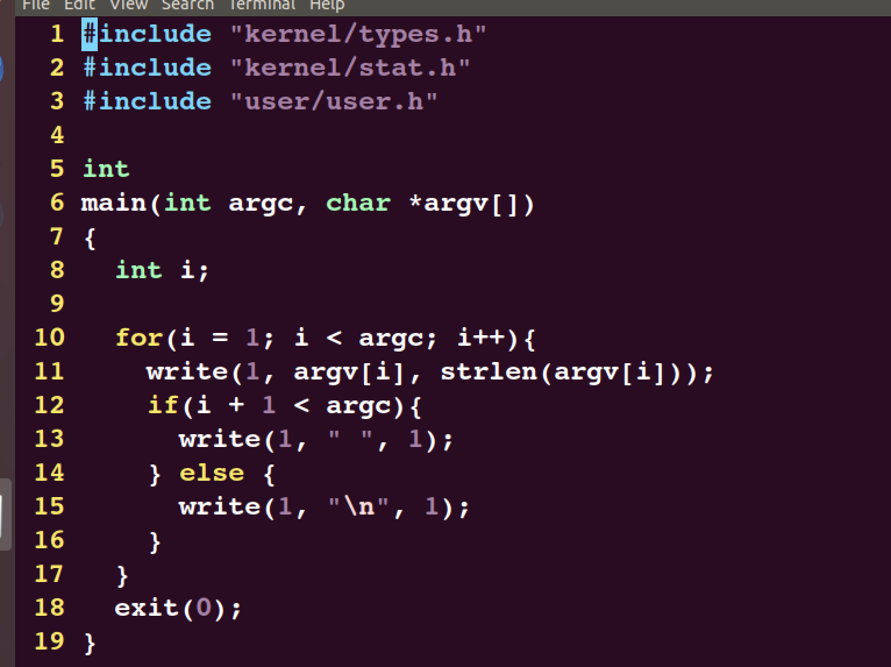
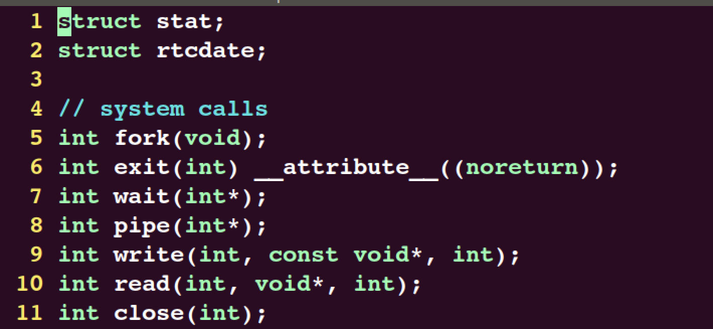
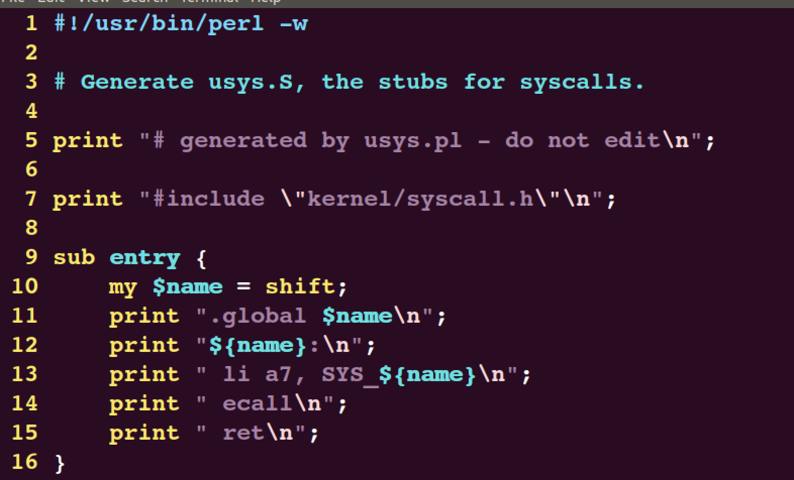
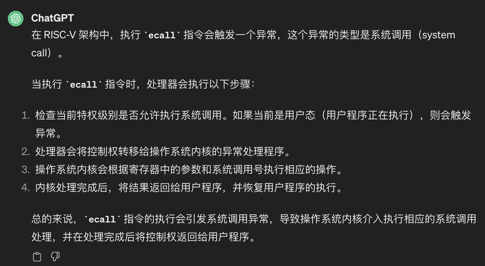
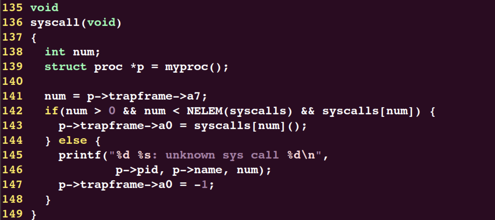
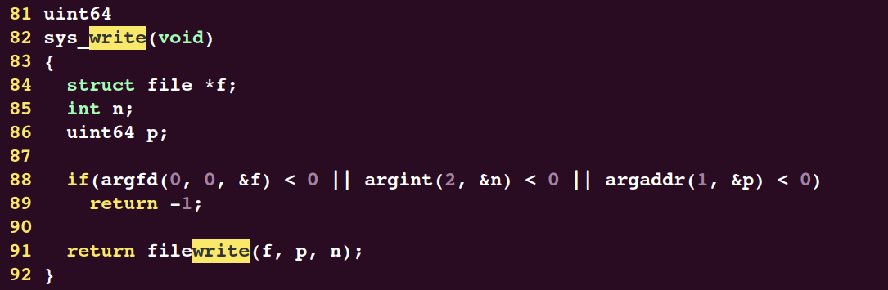
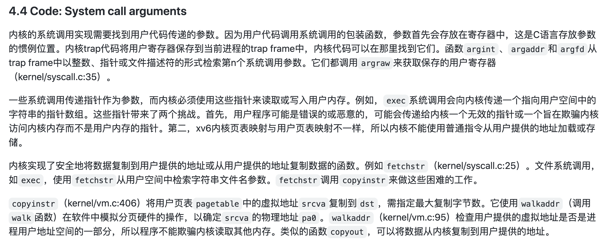

# lab2

## 回顾系统调用

lab2的实验代码很少，但是我认为这个实验却并不容易，因为其实它要求的是你对整个系统调用的流程有一个清晰的认知，话不多说，首先我们来对整个系统调用的过程进行一个回顾。

当你在shell上敲下一个命令，比如:

```bash
echo hello
```

会发生什么？

1. shell首先会调用`<parseline>`函数对整个字符串进行格式化，获得格式化的命令行参数(包括将要执行的程序路径以及相应的参数)，然后将这些命令行参数传入`<eval>`函数，在`<eval>`函数中`fork()`出一个子进程执行实际的程序；(有没有觉得上面的知识好像在csapp里面学习过?)

2. 进入子进程，对于此时实际执行的程序`echo`，在`echo`的用户侧实现里，我们可以看到，`echo`实际上是在调用`write`系统调用来完成我们的需求:



当执行到第11行代码时，我们的程序就会转入`write`系统调用代码的执行；

3. 对于任何一个系统调用函数，其函数原型必须在`user/user.h`头文件中进行定义:



而对于xv6来说，其函数的实际实现都是由`usys.pl`脚本生成的汇编代码来实现的:




首先将`write`的系统调用号`SYS_write`，(这是一个由宏定义的`int`型数字，用来表示每一种系统调用的编号)装入`a7`寄存器，然后调用`ecall`指令，`ecall`指令的作用如下:



4. 此时，操作系统转入内核态。首先会进入任何系统调用都会进入的，`kernel syscall handler`，也就是这个程序:



在`syscall()`，会根据上一步`a7`寄存器中的系统调用号，根据这个函数指针数组，调用具体的系统调用函数，此处也就是`sys_write`:



`sys_write`实际地将用户侧输入的参数`"hello"`字符串打印在标准在标准输出(此时会调用`argint`等函数读取参数):



不同的系统调用会在不同的文件中实现，比如`sys_write`在文件`sysfile.c`中实现，而第一个任务要求实现的`sys_trace`在`sysproc.c`中实现；

5. 当具体的系统调用结束时，会将返回值存储在当前进程保存的`a0`寄存器中(`syscall`第143行)，然后通过`ret`指令(即第3步中的汇编指令)返回到用户态，继续执行`echo.c`中的剩下的代码直到所有代码执行结束。此时，子进程结束退出，回到shell的主循环，等待用户的下一次输入。


## System call tracing

