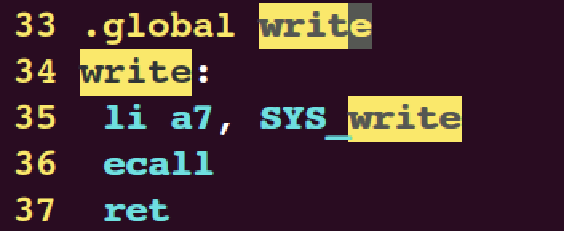

# lab2

## 回顾系统调用

lab2的实验代码很少，但是我认为这个实验却并不简单，因为其实它要求的是你对整个系统调用的流程有一个清晰的认知，话不多说，首先我们来对整个系统调用的过程进行一个回顾。

当你在shell上敲下一个命令，比如:

```bash
echo hello
```

会发生什么？

1. shell首先会调用`<parseline>`函数对整个字符串进行格式化，获得格式化的命令行参数(包括将要执行的程序路径以及相应的参数)，然后将这些命令行参数传入`<eval>`函数，在`<eval>`函数中`fork()`出一个子进程执行实际的程序；(有没有觉得上面的知识好像在csapp里面学习过?)

2. 进入子进程，对于此时实际执行的程序`echo`，在`echo`的用户侧实现里，我们可以看到，`echo`实际上是在调用`write`系统调用来完成我们的需求:


当执行到第11行代码时，我们的程序就会转入`write`系统调用代码的执行；

3. 对于任何一个系统调用函数，其函数原型必须在`user/user.h`头文件中进行定义:


而对于xv6来说，其函数的实际实现都是由`usys.pl`脚本生成的汇编代码来实现的:




首先将`write`的系统调用号`SYS_write`，(这是一个由宏定义的`int`型数字，用来表示每一种系统调用的编号)装入`a7`寄存器，然后调用`ecall`指令，`ecall`指令的作用如下:


4. 此时，操作系统转入内核态。首先会进入任何系统调用都会进入的，`kernel syscall handler`，也就是这个程序:


在`syscall()`，会根据上一步`a7`寄存器中的系统调用号，根据这个函数指针数组，调用具体的系统调用函数，此处也就是`sys_write`:


`sys_write`实际地将用户侧输入的参数`"hello"`字符串打印在标准输出(此时会调用`argint`等函数读取参数):


不同的系统调用会在不同的文件中实现，比如`sys_write`在文件`sysfile.c`中实现，而第一个任务要求实现的`sys_trace`在`sysproc.c`中实现；

5. 当具体的系统调用结束时，会将返回值存储在当前进程保存的`a0`寄存器中(`syscall`第143行)，然后通过`ret`指令(即第3步中的汇编指令)返回到用户态，继续执行`echo.c`中的剩下的代码直到所有代码执行结束。此时，子进程结束退出，回到shell的主循环，等待用户的下一次输入。


## System call tracing

进入本实验，查看要求:

> In this assignment you will add a system call tracing feature that may help you when debugging later labs. You'll create a new trace system call that will control tracing. It should take one argument, an integer "mask", whose bits specify which system calls to trace. For example, to trace the fork system call, a program calls trace(1 << SYS_fork), where SYS_fork is a syscall number from kernel/syscall.h. You have to modify the xv6 kernel to print out a line when each system call is about to return, if the system call's number is set in the mask. The line should contain the process id, the name of the system call and the return value; you don't need to print the system call arguments. The trace system call should enable tracing for the process that calls it and any children that it subsequently forks, but should not affect other processes.

所以我们实际上是要在内核中实现系统调用函数。查看`user`，发现用户侧的`trace.c`已经实现了。所以根据上面回顾的系统调用过程:

1. 第一步就是在`user.h`中添加函数的声明，以及在`usys.pl`脚本中添加entry:


2. 接下来，当进入内核时，会首先调用`syscall()`寻找`trace`的系统调用号以及对应的函数指针，所以应该在`syscall()`里进行相应的注册:

```c
// syscall.h
#define SYS_fork    1
#define SYS_exit    2

……

#define SYS_mkdir  20
#define SYS_close  21

/* add trace */
#define SYS_trace  22 

……

// syscall.c
extern uint64 sys_chdir(void);
extern uint64 sys_close(void);

……

extern uint64 sys_write(void);
extern uint64 sys_uptime(void);

extern uint64 sys_trace(void); 

static uint64 (*syscalls[])(void) = {
    [SYS_fork] sys_fork,   [SYS_exit] sys_exit,     [SYS_wait] sys_wait,
    [SYS_pipe] sys_pipe,   [SYS_read] sys_read,     [SYS_kill] sys_kill,
    [SYS_exec] sys_exec,   [SYS_fstat] sys_fstat,   [SYS_chdir] sys_chdir,
    [SYS_dup] sys_dup,     [SYS_getpid] sys_getpid, [SYS_sbrk] sys_sbrk,
    [SYS_sleep] sys_sleep, [SYS_uptime] sys_uptime, [SYS_open] sys_open,
    [SYS_write] sys_write, [SYS_mknod] sys_mknod,   [SYS_unlink] sys_unlink,
    [SYS_link] sys_link,   [SYS_mkdir] sys_mkdir,   [SYS_close] sys_close,
    [SYS_trace] sys_trace, 
}; 
```

3. 当`syscall()`调用了`trace`后，就会转入具体的`trace`的代码进行执行，所以此时我们需要在`kernel/sysproc.c`里去实现我们的`trace`调用。回顾实验的要求，给出的测试用例是:

```bash
trace 32 grep hello README
argv[0] = "trace"  -- trace 可执行程序
argv[1] = "32"		 -- 希望trace的系统调用号
argv[2] = "grep"	 -- Linux系统程序，其中会涉及一系列系统调用
...
```

阅读`user/trace.c`源码:
```c
#include "kernel/param.h"
#include "kernel/types.h"
#include "kernel/stat.h"
#include "user/user.h"

int
main(int argc, char *argv[])
{
  int i;
  char *nargv[MAXARG];

  if(argc < 3 || (argv[1][0] < '0' || argv[1][0] > '9')){
    fprintf(2, "Usage: %s mask command\n", argv[0]);
    exit(1);
  }

  if (trace(atoi(argv[1])) < 0) {
    fprintf(2, "%s: trace failed\n", argv[0]);
    exit(1);
  }
  
  for(i = 2; i < argc && i < MAXARG; i++){
    nargv[i-2] = argv[i];
  }
  exec(nargv[0], nargv);
  exit(0);
}
```

可以看到用户侧的`trace`执行流是先通过系统调用`trace`获得返回值，这个返回值代表了对`argc[1]`的合法性判断。之后则将`argv[2]`以及之后的命令行参数传入`exec`系统调用，创建新的子进程执行。

实验要求是要对`argv[1]`指定的系统调用打印相应的信息，所以问题便出现了:

- 对于每一个`exec`出的子进程，如何知道自己是否被`trace`?
- `argv[1]`是在用户侧命令行输入的参数，如何传递到内核?

第一个问题，根据`kernel/proc.h`中的定义，每一个进程实际上是由一个结构体表示，所以我们完全可以在这个结构体中，定义一个`mask`，表示希望`trace`的系统调用:

```c
struct proc {
  struct spinlock lock;

  // p->lock must be held when using these:
  enum procstate state;        // Process state
  struct proc *parent;         // Parent process
  void *chan;                  // If non-zero, sleeping on chan
  int killed;                  // If non-zero, have been killed
  int xstate;                  // Exit status to be returned to parent's wait
  int pid;                     // Process ID

  // these are private to the process, so p->lock need not be held.
  uint64 kstack;               // Virtual address of kernel stack
  uint64 sz;                   // Size of process memory (bytes)
  pagetable_t pagetable;       // User page table
  struct trapframe *trapframe; // data page for trampoline.S
  struct context context;      // swtch() here to run process
  struct file *ofile[NOFILE];  // Open files
  struct inode *cwd;           // Current directory
  char name[16];               // Process name (debugging)

  int mask;              
};
```

第二个问题，由“回顾”的第4小节，我们可以调用`argint`等参数来读取用户侧输入的参数。

所以`kernel/syscall.c`修改如下:

```c
const static *syscname[] = {
	 "fork", "exit", "wait", "pipe", "read", "kill", "exec", "fstat", "chdir", "dup",
  "getpid", "sbrk", "sleep", "uptime", "open", "write", "mknod", "unlink", "link",
  "mkdir", "close", "trace", "sysinfo"
}

void
syscall(void)
{
  int num;
  struct proc *p = myproc();

  num = p->trapframe->a7;
  if(num > 0 && num < NELEM(syscalls) && syscalls[num]) {
    p->trapframe->a0 = syscalls[num]();
    
	int mask = p->mask;
	if((mask >> num) & 1){
		printf("%d: syscall %s -> %d\n", p->pid, syscname[num - 1], p->trapframe->a0);
	}
	
  } else {
    printf("%d %s: unknown sys call %d\n",
            p->pid, p->name, num);
    p->trapframe->a0 = -1;
  }
}
```

4. 现在就要到`kernel/sysproc.c`里去具体实现我们的`sys_trace`函数了，回顾我们需要做的事情: 即调用`trace`时需要读入`argv[1]`并且保存在当前进程的`mask`变量中：

```c
uint64
sys_trace(){
	int mask;
  if(argint(0, &mask) < 0){
  	return -1;
  }
  struct proc* cur_proc = myproc();
  cur_proc->mask = mask;
  return 0;
}
```

5. 实验的最后一个要求:
> The trace system call should enable tracing for the process that calls it and any children that it subsequently forks, but should not affect other processes.

也就是说，如果`argv[2]`还创建了新的子进程，那么`trace`应该继续追踪这些新的子进程。我们知道`fork()`出的子进程资源是父进程的拷贝，所以查看`fork()`源码，并添加拷贝父进程`mask`到子进程:

```c
// Create a new process, copying the parent.
// Sets up child kernel stack to return as if from fork() system call.
int
fork(void)
{
  int i, pid;
  struct proc *np;
  struct proc *p = myproc();
  // Allocate process.
  if((np = allocproc()) == 0){
    return -1;
  }

	……
  
  pid = np->pid;
  np->state = RUNNABLE;
  release(&np->lock);

  /* copy mask to child process */
  np->mask = p->mask;
  return pid;
}
```

所有代码添加完毕，进行测试:


顺利通过。


