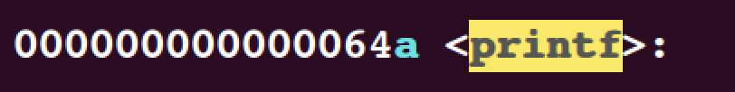
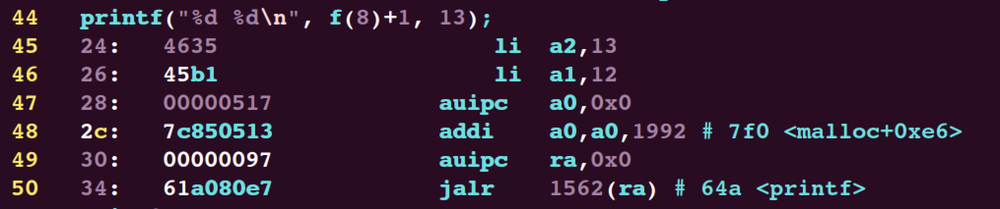

# lab 4

## RISC-V assembly

阅读`user/call.c`与`user/call.asm`回答一些简单问题:

> Which registers contain arguments to functions? For example, which register holds 13 in main's call to printf?

根据risc-v的手册，寄存器`a0 - a7`均可以存放函数参数，对于`main`函数来说，13存放在寄存器`a2`中:
```asm
	...
printf("%d %d\n", f(8)+1, 13);
  24:	4635                	li	a2,13
  26:	45b1                	li	a1,12
 	...
```


> Where is the call to function f in the assembly code for main? Where is the call to g? (Hint: the compiler may inline functions.)

在`main`的汇编代码中:

```asm
	...
printf("%d %d\n", f(8)+1, 13);
  24:	4635                	li	a2,13
  26:	45b1                	li	a1,12
  28:	00000517          	auipc	a0,0x0
  ...
```
可以看到`a1`寄存器存放`printf`的第一个参数，而第一个参数刚好是对`f`和`g`的调用，所以此时的函数调用被编译器优化成了一条指令。


> At what address is the function printf located?

在`vim`中可以查找到其位置:


```asm
30:	00000097          	auipc	ra,0x0
34:	61a080e7          	jalr	1562(ra) # 64a <printf>
```
此时`PC = 0x30`，所以计算过程是:
```asm
1562 + 0x30 = 0x64a
```


> What value is in the register ra just after the jalr to printf in main?

`jalr`这个指令会把下一个要执行的指令的地址压入`ra`, 即:
```bash
0x34 + 4 = 0x38
```


> Run the following code.
> ```c
	unsigned int i = 0x00646c72;
	printf("H%x Wo%s", 57616, &i);
	```
> What is the output? Here's an ASCII table that maps bytes to characters.
The output depends on that fact that the RISC-V is little-endian. If the RISC-V were instead big-endian what would you set i to in order to yield the same output? Would you need to change 57616 to a different value?

57616 转换为 16 进制为 e110，所以格式化描述符 %x 打印出了它的 16 进制值。
其次，如果在小端（little-endian）处理器中，数据0x00646c72 的高字节存储在内存的高位，那么从内存低位，也就是低字节开始读取，对应的 ASCII 字符为 rld。
如果在 大端（big-endian）处理器中，数据 0x00646c72 的高字节存储在内存的低位，那么从内存低位，也就是高字节开始读取其 ASCII 码为 dlr。
所以如果大端序和小端序输出相同的内容 i ，那么在其为大端序的时候，i 的值应该为 0x726c64，这样才能保证从内存低位读取时的输出为 rld 。
无论 57616 在大端序还是小端序，它的二进制值都为 e110 。大端序和小端序只是改变了多字节数据在内存中的存放方式，并不改变其真正的值的大小，所以 57616 始终打印为二进制 e110 。


> In the following code, what is going to be printed after 'y='? (note: the answer is not a specific value.) Why does this happen?

```c
	printf("x=%d y=%d", 3);
```
函数的参数是通过寄存器`a1`, `a2` 等来传递。如果`prinf`少传递一个参数，那么其仍会从一个确定的寄存器中读取其想要的参数值，但是我们并没有给出这个确定的参数，所以函数将从`a2`中获取到一个随机的不确定的值。


## Backtrace 

首先按照实验要求在相应的文件里做修改:

```c
/* kernel/defs.h */
...
void            panic(char*) __attribute__((noreturn));
void            printfinit(void);
void						backtrace(void);
...

/* kernel/riscv.h */
...
static inline uint64
r_fp()
{
  uint64 x;
  asm volatile("mv %0, s0" : "=r" (x) );
  return x;
}
...

/* kernerl/sysproc.c */

uint64
sys_sleep(void)
{
  ...
  uint ticks0;

  backtrace();

  if(argint(0, &n) < 0)
    return -1;
  acquire(&tickslock);
  ... 
}
```

根据实验要求:
> The compiler puts in each stack frame a frame pointer that holds the address of the caller's frame pointer. Your backtrace should use these frame pointers to walk up the stack and print the saved return address in each stack frame.

即需要通过帧指针来遍历栈，并打印每一个栈帧中保存的返回地址。栈的结构如图所示:




并且有提示:

> Xv6 allocates one page for each stack in the xv6 kernel at PAGE-aligned address. You can compute the top and bottom address of the stack page by using `PGROUNDDOWN(fp)` and `PGROUNDUP(fp)` (see `kernel/riscv.h`. These number are helpful for backtrace to terminate its loop.

xv6为内核中的每个栈分配了一个页面，所以我们通过判断当前的帧指针是否与下一个将要访问的帧指针具有同样的页信息来判断是否要继续进行访问。

代码实现如下:

```c
void backtrace(void){
	printf("backtrace:\n");
	uint64 return_address;
	uint64 fp = r_fp();
	uint64 pre_fp = *(uint64 *)(fp - 16);
	
	while(PGROUNDDOWN(fp) == PGROUNDDOWN(pre_fp)){
		return_address = *((uint64 *)(fp - 8));
		printf("%p\n", return_address);
		fp = pre_fp;
		pre_fp = *((uint64 *)(fp - 16));
	}
	return_address = *((uint64 *)(fp - 8));
	printf("%p\n", return_address);
}
```

测试:


